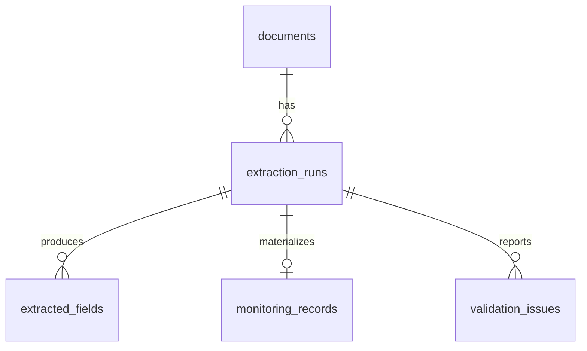

# LLM-Enhanced PDF Structured Data Extraction Pipeline

[](https://github.com/xiaoyao12740/llm-pdf-data-extraction/actions/workflows/ci.yml) · English | [中文](README_zh-CN.md)

A reproducible, provenance-first pipeline that converts heterogeneous PDF monitoring reports into validated records. Deterministic rules handle explicit values, a local LLM is invoked only for uncertain or missing fields, application code retains final authority, and MySQL preserves the complete lineage.


## Business Problem

Operational PDFs express the same facts as key-value blocks, renamed fields, split lines, tables, and prose. A one-shot “PDF → LLM → JSON” workflow is expensive, difficult to audit, and vulnerable to invented values. This project instead implements:

`PDF → page-aware parsing → rule candidates → selective LLM validation → normalization → schema/cross-field validation → MySQL → evaluation`

## Key Features

- Five seeded PDF layouts and per-document ground truth, with no personal data.
- PyMuPDF text parsing and pdfplumber table parsing without losing page numbers.
- Alias-aware extraction with raw value, normalized candidate, page, evidence, method, confidence, and validation status.
- Configurable Ollama provider; the model sees only relevant document context and must return strict JSON.
- Hallucination-aware evidence gate: unsupported values return `null`; non-verbatim evidence is rejected.
- Pydantic schema plus numeric, range, date, and missing-field checks.
- Atomic MySQL persistence across documents, runs, extracted fields, business records, and issues.
- CSV/JSON exports, measured ground-truth metrics, quality summaries, figures, pytest, and GitHub Actions.

## Dataset and Templates


The command below creates 100 reports—20 per layout—and a matching `ground_truth.json`. Injected anomalies include inconsistent rates, missing rates, and reversed periods. Ground truth retains the correct value separately from the value displayed in the PDF.

```bash
python -m src.generators.generate_sample_pdfs --count 100 --seed 42
```

## Extraction and LLM Strategy


Rules produce deterministic candidates first. Only missing candidates or candidates below `--confidence-threshold` are offered to Ollama. The provider must return:

```json
{"field":"sample_count","value":1200,"confidence":0.91,"evidence":"processed 1,200 specimens","reason":"explicit total"}
```

The evidence must occur verbatim in the supplied text. Invalid JSON, unsupported evidence, or incompatible values are rejected and recorded; an LLM response never bypasses programmatic validation.

## Measured Results

The following results were generated locally from 100 PDFs and 700 evaluated fields using seed 42. They are stored in `reports/metrics/`; they are not hand-written estimates.

| Method | Local model | Field accuracy | Missing-field rate | Exact-match documents |
|---|---|---:|---:|---:|
| Rules Only | — | 97.57% | 0.57% | 87/100 |
| Rules + Ollama | qwen2.5:7b | 97.57% | 0.57% | 87/100 |

The LLM correctly declined to invent four rates absent from the source, so it produced no artificial accuracy gain. The rules-only run found 13 genuine issues: 4 reversed date ranges, 5 inconsistent rates, and 4 missing fields.


## MySQL Data Model




All DDL and queries use MySQL 8.0+ with `utf8mb4`; SQLite is not used. SHA-256 prevents duplicate documents, while each new run preserves parser/model metadata. Persistence is transactional per document.

## Quick Start

```bash
python -m venv .venv
.venv/Scripts/python -m pip install -r requirements.txt
.venv/Scripts/python -m src.generators.generate_sample_pdfs --count 100 --seed 42
.venv/Scripts/python -m src.pipeline --llm disabled --database disabled
.venv/Scripts/python -m pytest -q
```

On Linux/macOS, use `.venv/bin/python` instead.

### Ollama

Install and start Ollama, pull a model that exists in your environment, then run:

```bash
ollama pull qwen2.5:7b
python -m src.pipeline --llm ollama --model qwen2.5:7b --confidence-threshold 0.60
```

The model name is configurable; the project does not assume every model is installed.

### MySQL

Copy `.env.example` to `.env`, replace the example credentials, execute `sql/01_create_database.sql`, `02_create_tables.sql`, and `03_create_indexes.sql`, then run:

```bash
python -m src.pipeline --database mysql
```

Live persistence was verified on MySQL 8.0.42 using a local instance configured on port 3305. A 100-document run produced 100 documents, 100 extraction runs, 696 provenance fields, 100 monitoring records, and 13 validation issues. The port remains environment-configurable; 3306 is the portable default in `.env.example`.

## Outputs

```text
data/processed/
  structured_records.csv
  structured_records.json
  extraction_details.json
reports/metrics/
  rules_only_metrics.json
  rules_llm_metrics.json
  validation_summary.json
reports/figures/
  01_system_architecture.png ... 07_validation_issues.png
```

## Repository Structure

```text
config/                 Runtime and field schema examples
data/                   Raw, ground-truth, and processed data locations
src/generators/         Reproducible PDF generator
src/parsers/            Page-aware text/table parsers
src/extraction/         Alias mapping and rule candidates
src/llm/                Provider interface, prompts, Ollama client
src/normalization/      Canonical value conversion
src/validation/         Pydantic and consistency checks
src/database/           MySQL engine and transactional repository
src/evaluation/         Ground-truth metrics
src/visualization/      Quality figures
sql/                    MySQL DDL, indexes, quality and analysis queries
tests/                  Unit and integration-oriented tests
```

## Limitations and Future Work

- Scanned PDFs require an OCR provider.
- Table parsing is optimized for simple tabular reports, not merged-cell forms.
- Local CPU inference is slow; selective field routing is essential.
- The synthetic benchmark tests controlled variation, not every real-world domain.
- Future work can add OCR, asynchronous LLM batching, human review queues, confidence calibration, and production observability.

## Tech Stack and License

Python 3.10+, PyMuPDF, pdfplumber, reportlab, Pydantic, Ollama, SQLAlchemy, PyMySQL, pandas, NumPy, Matplotlib, pytest, GitHub Actions, MySQL 8.0. MIT licensed.
