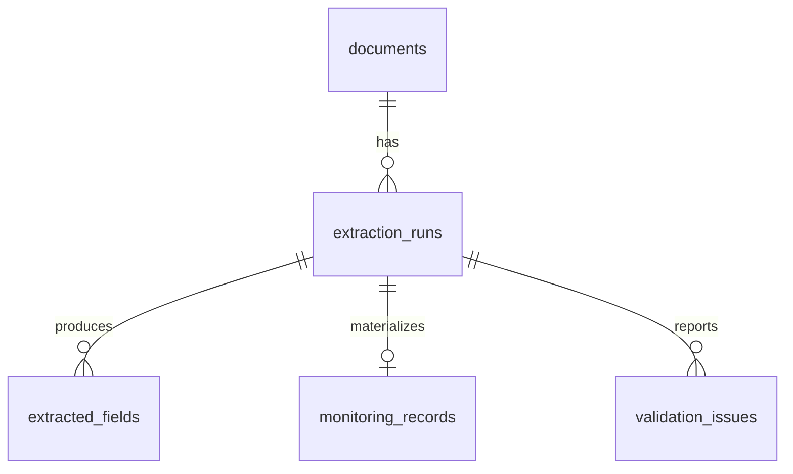

# LLM-Enhanced PDF Structured Data Extraction Pipeline

English | [中文](README_zh-CN.md)

> Phase 1: a reproducible, page-aware PDF data pipeline combining deterministic extraction, validation, provenance-ready records, and a MySQL 8.0 schema. LLM semantic validation is intentionally reserved for Phase 2.


## Overview and Business Problem

Operational reports arrive as inconsistent key-value blocks, renamed fields, multiline content, tables, and prose. This project turns those PDFs into traceable structured candidates without sending an entire document to a black-box model or inventing missing values.

## Key Features

- Five seeded synthetic templates with per-file ground truth and deliberate rate anomalies.
- PyMuPDF text parsing plus pdfplumber table parsing, retaining page numbers.
- Alias-aware rule extraction returning evidence, method, confidence, and normalized candidates.
- Cross-field/range/date validation that reports issues without silently changing source data.
- MySQL 8.0 schema covering documents, runs, fields, records, and validation issues.

## Synthetic Dataset and PDF Templates


The generator creates no personal data. A fixed seed makes layout distribution and values reproducible. `ground_truth.json` separates correct values from deliberately displayed anomalies.

## Rule-based Extraction


Every candidate contains `field_name`, `raw_value`, `normalized_candidate`, `page_number`, `source_text`, `extraction_method=rule`, and `confidence`. Low-confidence narrative candidates are ready for a future field-scoped LLM validator.

## MySQL Data Model




All SQL uses MySQL 8.0+ and `utf8mb4`; SQLite is not used.

## Quick Start

```bash
python -m venv .venv
.venv/Scripts/python -m pip install -r requirements.txt
.venv/Scripts/python -m src.generators.generate_sample_pdfs --count 100 --seed 42
.venv/Scripts/python -m src.pipeline
.venv/Scripts/python -m pytest -q
```

## MySQL Setup

Copy `.env.example` to `.env`, replace the sample credentials, then run `sql/01_create_database.sql`, `02_create_tables.sql`, and `03_create_indexes.sql` with a MySQL 8.0 client. Credentials are never hard-coded.

## Repository Structure

`src/` contains generation, parsing, extraction, validation, and database modules; `sql/` contains DDL and analysis queries; `tests/` contains automated checks; `reports/figures/` contains README assets.

## Tests, Roadmap, and Tech Stack

Tests cover PDF parsing, canonical and alias extraction, count/rate consistency, and date ranges. Phase 2 will add normalization/persistence refinements and Ollama-based semantic validation; no LLM accuracy claim or fabricated comparison is included here.

Python 3.10+, PyMuPDF, pdfplumber, reportlab, Pydantic, SQLAlchemy, PyMySQL, pandas, NumPy, Matplotlib, pytest, MySQL 8.0. MIT licensed.
