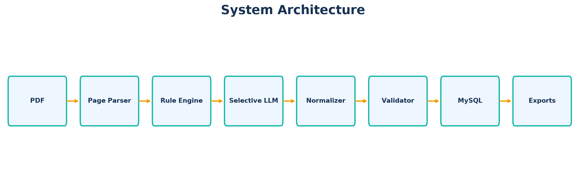
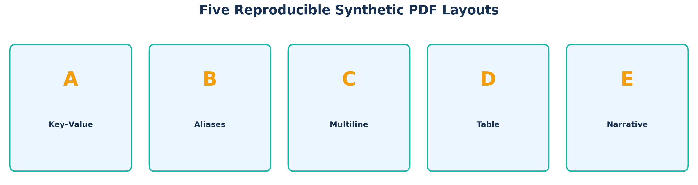
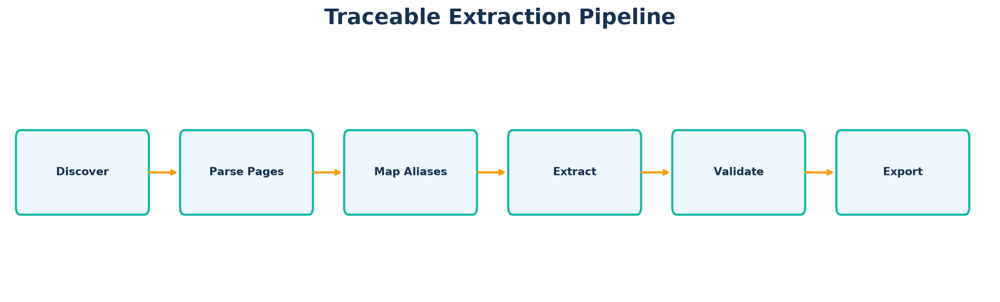
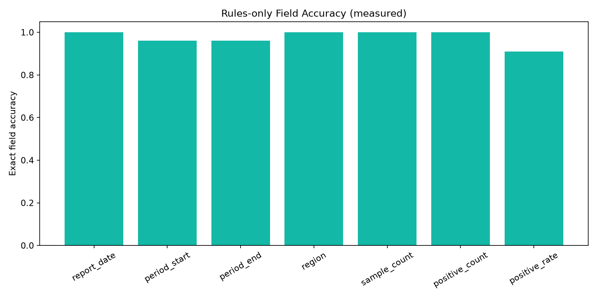
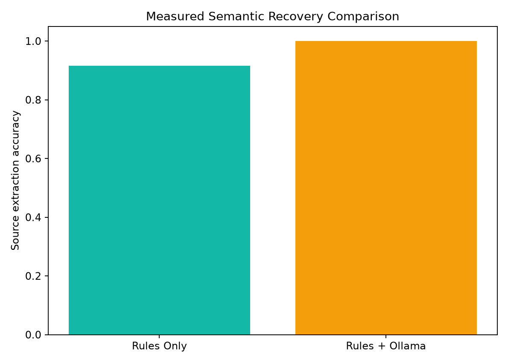
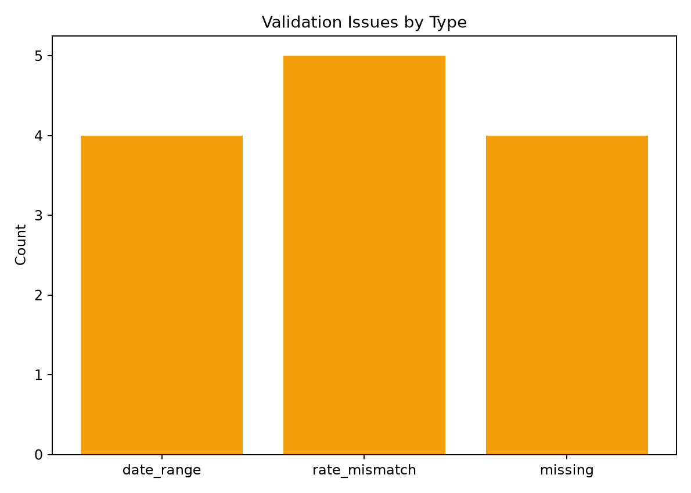
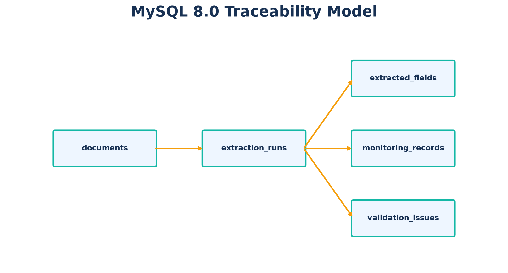
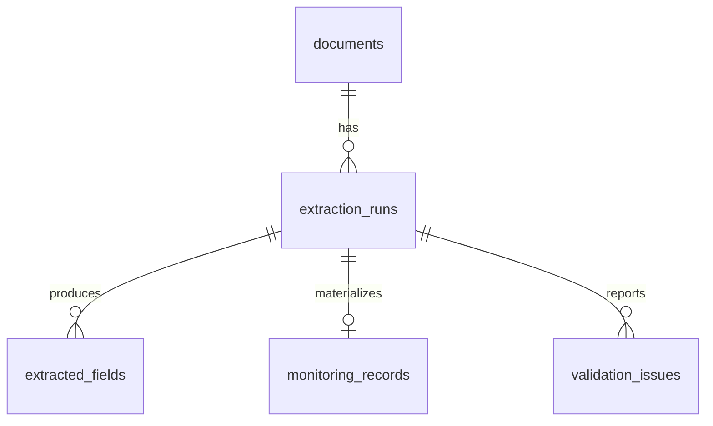

# LLM-Enhanced PDF Structured Data Extraction Pipeline

[](https://github.com/xiaoyao12740/llm-pdf-data-extraction/actions/workflows/ci.yml) · English | [中文](README_zh-CN.md)

An auditable, rules-first PDF extraction prototype with selective local-LLM semantic recovery, typed evidence validation, ground-truth evaluation, and MySQL provenance.



## Why this architecture?

A one-shot `PDF → LLM → JSON` flow is expensive and difficult to audit. This project uses:

`PDF → page-aware parsing → deterministic candidates → selective LLM recovery → normalization → schema/business validation → MySQL → optional evaluation`

Rules own deterministic values. The LLM is consulted only for missing or low-confidence fields. Application code validates types, claimed page, verbatim evidence, and business consistency. The model cannot replace a deterministic candidate solely with self-reported confidence.

## Key capabilities

- PyMuPDF text and pdfplumber table parsing with page numbers preserved.
- Five seeded PDF layouts: key-value, aliases, multiline, table, and semantic narrative.
- Field provenance: raw/normalized value, page, quote, method (`rule`, `table`, `llm`), confidence, validation status, and extraction run.
- Pydantic-typed Ollama responses with exact quote-to-page binding.
- Field-specific context retrieval; program markers are never accepted as PDF evidence.
- Configurable `fallback_rules` or `fail_fast` policy when Ollama is unavailable.
- Separate source truth and canonical truth metrics, plus anomaly precision/recall/F1.
- Transactional MySQL persistence and CI integration tests against MySQL 8.0.

## Reproducible benchmark



The generator creates 100 privacy-safe reports (20 per layout). Twenty narrative reports contain 60 values that are explicit to a reader but intentionally outside the deterministic patterns. Separate anomaly injection adds reversed periods, inconsistent rates, and genuinely missing rates.

Each truth record stores:

- `source_truth`: what the PDF actually displays;
- `canonical_truth`: the correct business value;
- `anomaly_type`: the expected validation issue.

```bash
python -m src.generators.generate_sample_pdfs --count 100 --seed 42
```

## Selective LLM safety contract



The LLM receives retrieved text chunks, not PDF bytes or ground truth. It must return a typed object containing `field`, `value`, `confidence`, `page_number`, `evidence`, and `reason`. A non-null result is accepted only when the evidence occurs verbatim on the claimed PDF page. Invalid JSON, arrays/scalars, wrong fields/pages, fabricated quotes, normalization errors, timeouts, and HTTP failures are rejected or downgraded according to policy.

## Measured results

These numbers were generated from seed 42, 100 PDFs, and 700 evaluated fields. They are stored in `reports/metrics/`.

| Method | Source extraction | Canonical match | Source exact documents | Canonical exact documents | Anomaly F1 |
|---|---:|---:|---:|---:|---:|
| Rules Only | 91.57% | 89.29% | 80/100 | 70/100 | 54.55% |
| Rules + Ollama (`qwen2.5:7b`) | **100.00%** | **97.57%** | **100/100** | **87/100** | **100.00%** |

The local-LLM run made 63 field calls in 868.25 seconds on CPU: 59 evidence-bound semantic recoveries, 4 abstentions for genuinely absent values, and 0 accepted hallucinations. The remaining canonical mismatch is intentional: extraction preserves anomalous source values while validation reports 4 reversed date ranges, 5 inconsistent rates, and 4 missing rates.







## Production extraction and evaluation are separate

Extraction does not require ground truth:

```bash
python -m src.pipeline --llm disabled --database disabled
python -m src.pipeline --llm ollama --model qwen2.5:7b --llm-failure-policy fallback_rules
```

Benchmark evaluation is explicit:

```bash
python -m src.pipeline --llm disabled --evaluate
python -m src.evaluation.evaluate_extraction \
  --results data/processed/extraction_details.json \
  --ground-truth data/ground_truth/ground_truth.json
```

Unknown business PDFs therefore remain extractable even when no benchmark file exists.

## MySQL provenance model





MySQL 8.0 uses SHA-256 document identity, transactional per-document writes, unique `(run_id, field_name)` fields, one business record per run, and run metadata for batch, pipeline/schema/prompt versions, config hash, and git commit. Existing v1 databases can apply `sql/06_upgrade_v2.sql` once.

## Quick start

```bash
python -m venv .venv
.venv/Scripts/python -m pip install -r requirements.txt
.venv/Scripts/python -m src.generators.generate_sample_pdfs --count 100 --seed 42
.venv/Scripts/python -m src.pipeline --llm disabled
.venv/Scripts/python -m pytest -q
```

Use `.venv/bin/python` on Linux/macOS.

The repository includes three safe synthetic PDFs under `samples/`. To drive paths, validation tolerance, MySQL, and Ollama from YAML, copy `config/config.example.yaml`, edit it, and run `python -m src.pipeline --config config/config.yaml`; explicit CLI options override the corresponding YAML values.

For MySQL, copy `.env.example` to `.env`, replace credentials, run `sql/01_create_database.sql`, `02_create_tables.sql`, and `03_create_indexes.sql`, then use `--database mysql`. A prior 100-document persistence run was verified on MySQL 8.0.42; CI now creates a fresh MySQL 8.0 service for repository, duplicate-hash, uniqueness, and rollback tests.

## Tests and CI

Local tests cover multi-page, image-only, and corrupt PDF behavior; aliases; table provenance; normalization; source/canonical metrics; anomaly scoring; YAML configuration; evidence/page binding; invalid JSON shapes; deterministic arbitration; and ground-truth-independent extraction. GitHub Actions tests Python 3.10, 3.11, and 3.12 with MySQL 8.0 and runs Ruff.

## Limitations

- This is an engineering prototype, not a claim of universal PDF generalization.
- Scanned/image-only PDFs require OCR.
- Complex merged tables need a stronger layout model.
- CPU local inference is slow; selective routing is essential.
- Evidence binding reduces hallucination risk but does not prove complete prompt-injection resistance.
- Confidence values are heuristic and not yet calibrated.

## Tech stack

Python 3.10+, PyMuPDF, pdfplumber, reportlab, Pydantic, Ollama, SQLAlchemy, PyMySQL, MySQL 8.0, Matplotlib, pytest, Ruff, GitHub Actions. MIT licensed.
