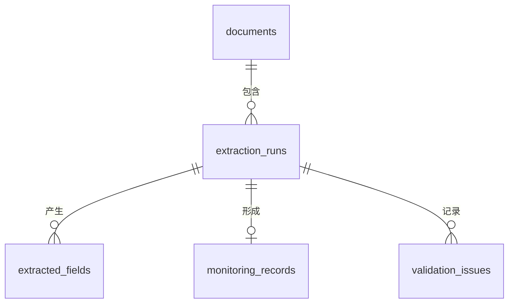

# 基于 LLM 增强的 PDF 非结构化数据智能抽取系统

[](https://github.com/xiaoyao12740/llm-pdf-data-extraction/actions/workflows/ci.yml) · [中文](README_zh-CN.md) | [English](README.md)

一个可复现、溯源优先的 PDF 数据管道：确定性规则负责明确值，本地 LLM 只处理不确定或缺失字段，程序保留最终决定权，MySQL 保存完整数据血缘。


## 业务问题与设计原则

业务 PDF 经常用键值对、字段改名、跨行、表格和自然语言表达同一概念。一次性“PDF → LLM → JSON”难以审计且容易产生幻觉。本项目采用：

`PDF → 保留页码的解析 → 规则候选 → 选择性 LLM 校验 → 标准化 → Schema/跨字段校验 → MySQL → 评估`

规则负责确定性信息，LLM 负责模糊语义，程序负责最终验证，MySQL 负责持久化。

## 核心功能

- 五种可复现合成 PDF 模板，每份报告都有 ground truth，不含真实个人信息。
- PyMuPDF 文本解析与 pdfplumber 表格解析，全程保留页码。
- 字段别名映射，记录原始值、候选值、页码、证据、方法、置信度和验证状态。
- 可配置 Ollama；只向模型发送相关上下文，不发送整份 PDF。
- 防幻觉门禁：无明确支持必须返回 `null`，证据不是原文逐字子串则拒绝。
- Pydantic Schema 与计数、比率、范围、日期、缺失字段校验。
- MySQL 单文档事务写入文档、运行、字段、业务记录和异常。
- CSV/JSON 导出、真实 ground truth 指标、质量图、pytest 和 GitHub Actions。

## 合成数据集


固定 seed 生成 100 份报告，每种布局 20 份。异常包括比率不一致、比率缺失和日期范围反转；ground truth 将正确值与 PDF 展示值分开保存。

```bash
python -m src.generators.generate_sample_pdfs --count 100 --seed 42
```

## 抽取与 LLM 策略


规则先生成候选。只有字段缺失或低于 `--confidence-threshold` 才调用 Ollama。模型必须返回严格 JSON，例如：

```json
{"field":"sample_count","value":1200,"confidence":0.91,"evidence":"processed 1,200 specimens","reason":"explicit total"}
```

证据必须逐字存在于提供的上下文。非法 JSON、虚假证据和类型不兼容值都会被拒绝并记录，LLM 不能绕过程序校验。

## 实测结果

以下数据来自 seed 42、100 份 PDF、700 个字段的实际运行，保存在 `reports/metrics/`，不是手写估计：

| 方法 | 本地模型 | 字段准确率 | 缺失率 | 整份完全匹配 |
|---|---|---:|---:|---:|
| Rules Only | — | 97.57% | 0.57% | 87/100 |
| Rules + Ollama | qwen2.5:7b | 97.57% | 0.57% | 87/100 |

LLM 对原文中缺失的 4 个比率返回了 `null`，没有制造虚假提升。规则基线检测到 13 个真实问题：4 个日期反转、5 个比率不一致、4 个字段缺失。


## MySQL 数据模型




全部 DDL 和查询使用 MySQL 8.0+、`utf8mb4`，不使用 SQLite。SHA-256 防止重复文档；每次运行保留解析器、LLM provider 和模型信息；写入按文档事务提交。

## 快速开始

```bash
.venv/Scripts/python -m pip install -r requirements.txt
.venv/Scripts/python -m src.generators.generate_sample_pdfs --count 100 --seed 42
.venv/Scripts/python -m src.pipeline --llm disabled --database disabled
.venv/Scripts/python -m pytest -q
```

### Ollama

```bash
ollama pull qwen2.5:7b
python -m src.pipeline --llm ollama --model qwen2.5:7b --confidence-threshold 0.60
```

模型名可配置，项目不假定某个模型一定已安装。

### MySQL

复制 `.env.example` 为 `.env`，替换示例凭据，依次执行 `sql/01_create_database.sql`、`02_create_tables.sql` 和 `03_create_indexes.sql`，然后运行：

```bash
python -m src.pipeline --database mysql
```

已在本地 MySQL 8.0.42、端口 3305 上完成真实持久化验证。100 份文档产生 100 条 documents、100 次 extraction_runs、696 条字段溯源、100 条 monitoring_records 和 13 条 validation_issues。端口通过环境变量配置，`.env.example` 仍以通用默认端口 3306 为例。

## 输出与仓库结构

`data/processed/` 输出结构化 CSV、JSON 和字段级溯源详情；`reports/metrics/` 保存规则与 LLM 的真实指标及校验汇总；`reports/figures/` 保存七张项目图片。源码按生成、解析、抽取、LLM、标准化、校验、数据库、评估和可视化拆分，SQL 与测试独立维护。

## 局限与后续方向

- 扫描 PDF 需要 OCR。
- 复杂合并单元格和表单需要更强的版面模型。
- 本地 CPU 推理较慢，因此必须选择性调用 LLM。
- 合成基准覆盖受控变化，不能代表所有真实行业文档。
- 后续可增加 OCR、异步批处理、人工复核队列、置信度校准和生产监控。

技术栈：Python 3.10+、PyMuPDF、pdfplumber、reportlab、Pydantic、Ollama、SQLAlchemy、PyMySQL、pandas、NumPy、Matplotlib、pytest、GitHub Actions、MySQL 8.0。MIT License。
