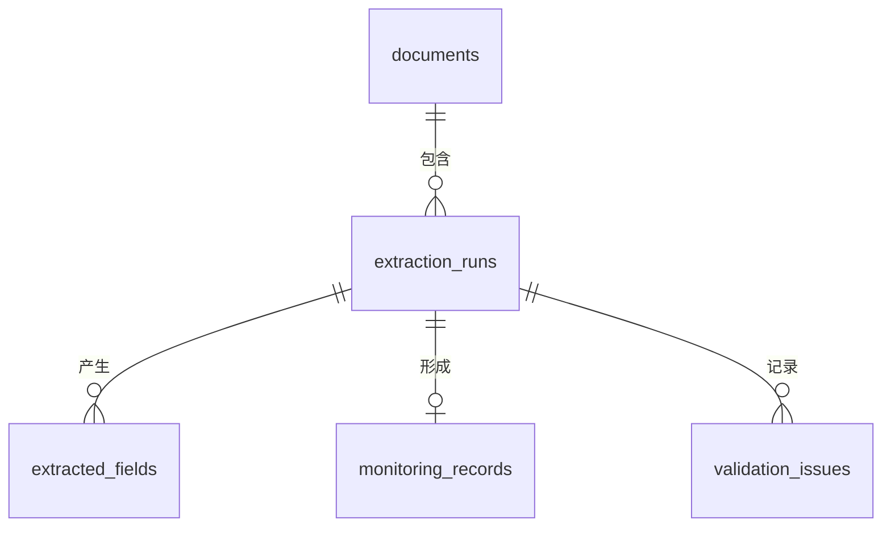

# 基于 LLM 增强的 PDF 非结构化数据智能抽取系统

[中文](README_zh-CN.md) | [English](README.md)

> 第一阶段：可复现、保留页码的数据管道，完成确定性抽取、数据校验、可追溯结果和 MySQL 8.0 Schema。LLM 语义校验明确留到下一阶段。


## 项目概览与业务问题

实际报告常以键值对、字段改名、跨行、表格和自然语言等不同形式出现。本项目把 PDF 转换成可追溯的结构化候选值，不把整份文档直接交给黑盒模型，也不为缺失字段编造数据。

## 核心功能

- 五种固定随机种子的合成模板；每份文件有 ground truth，并包含少量故意制造的比率异常。
- 使用 PyMuPDF 提取文本、pdfplumber 提取表格，始终保留页码。
- 支持字段别名的规则抽取，返回证据、方法、置信度和标准化候选值。
- 范围、日期、跨字段一致性校验；只报告异常，不静默修改原数据。
- MySQL 8.0 五表模型，覆盖文档、运行、字段、业务记录和校验问题。

## 合成数据集与 PDF 模板


生成器不包含真实个人信息。固定 seed 保证布局分布和数值可复现。`ground_truth.json` 将正确值与异常 PDF 中的展示值分开记录。

## 规则抽取


每个候选字段都包含字段名、原始值、标准化候选值、页码、原文证据、`rule` 方法与置信度。低置信度的叙述型候选已为后续“仅发送相关上下文”的 LLM 校验留好接口边界。

## MySQL 数据模型




全部 SQL 使用 MySQL 8.0+ 与 `utf8mb4`，不使用 SQLite。

## 快速开始

```bash
.venv/Scripts/python -m pip install -r requirements.txt
.venv/Scripts/python -m src.generators.generate_sample_pdfs --count 100 --seed 42
.venv/Scripts/python -m src.pipeline
.venv/Scripts/python -m pytest -q
```

## MySQL 配置

复制 `.env.example` 为 `.env` 并替换示例凭据，然后依次执行 `sql/01_create_database.sql`、`02_create_tables.sql`、`03_create_indexes.sql`。代码不硬编码密码。

## 仓库结构、测试与路线图

`src/` 放生成、解析、抽取、校验和数据库模块；`sql/` 放 DDL 与分析查询；`tests/` 放自动化测试；`reports/figures/` 放 README 图片。测试覆盖 PDF 解析、标准字段与别名、计数/比率一致性和日期范围。下一阶段再加入持久化完善与 Ollama 语义校验；本阶段不编造任何 LLM 准确率或对比结果。

技术栈：Python 3.10+、PyMuPDF、pdfplumber、reportlab、Pydantic、SQLAlchemy、PyMySQL、pandas、NumPy、Matplotlib、pytest、MySQL 8.0。MIT License。
